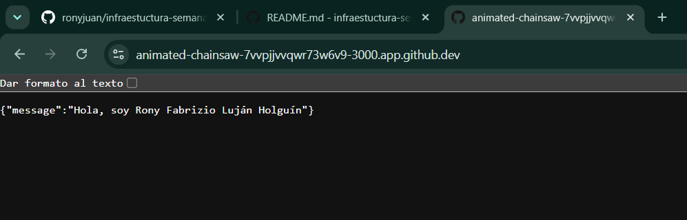

# Laboratorio 02

Hoy utilizaremos docker compose para poder desplegar su trabajo. Servicio web y una base de datos

## Stack
API
  - Minimal API
    - Debe retornar un mensaje incluyendo mi nombre
  - Docker

BD
  - PostgreSQL

# Indicaciones

## Comandos

docker compose up -d

## Configuración por entorno

MESSAGE=<Colocar nombre>

Respuestas

Tipos de redes en Docker:

Bridge: Es la red por defecto aisla los contenedores pero los deja comunicarse entre ellos
Host: El contenedor usa la red de la máquina directamente
None: El contenedor no tiene conexión a red
Overlay: Conecta múltiples demonios de Docker
Macvlan: Asigna una dirección MAC al contenedor

Tipos de volúmenes en Docker:

Volumes: Gestionados por Docker son la mejor opción para bases de datos
Bind mounts: Conectan una ruta específica de tu computadora al contenedor
tmpfs mounts: Se guardan solo en la memoria RAM

.